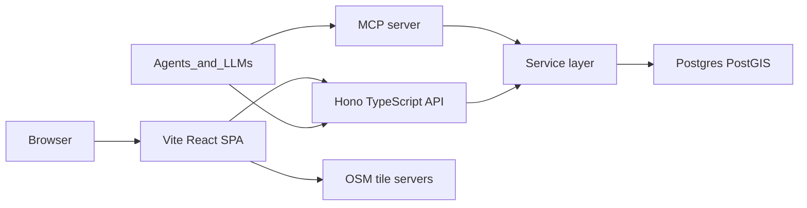

# Trip Planning - architecture

Canonical record of the technical decisions for this project. See [`.cursor/plan.md`](.cursor/plan.md) for the product vision.

## Source of truth

| Question | Canonical doc |
|---|---|
| Product vision / what to build | [`.cursor/plan.md`](.cursor/plan.md) |
| How it is built (stack, structure, conventions) | This file |

This doc lists what is **decided**, what is intentionally **deferred**, and the conventions that keep later work coherent. It contains no application code, Dockerfiles, or migrations.

## 1. Purpose and relationship to the plan

The plan calls for a map-first itinerary app whose data can later be grounded on by agents / LLMs. That single requirement drives the backend shape: agents **call** a backend over HTTP/MCP, they do not need to **be** the backend. So the stack optimizes for a stable, resource-oriented API and a service layer that both HTTP handlers and MCP tools reuse — rather than for a Python agent runtime.

## 2. Decided stack

- **Frontend:** React + TypeScript SPA, built with **Vite**.
- **Backend:** standalone **TypeScript** API using **Hono** + Zod-generated OpenAPI. Not Python, not Next.js.
- **Agent access:** the same service layer is exposed as REST/OpenAPI *and* as **MCP** tools. MCP may ship after the first useful UI, but handlers stay thin so adding tools is mechanical.
- **Database:** **PostgreSQL** with **PostGIS** enabled from day one.
- **Maps:** **MapLibre GL** with **OpenStreetMap** tiles.
- **Packaging:** **Docker**, local Compose with `web`, `api`, and `db`. MCP runs as a process against the service layer, not its own database.
- **Audience:** **single-user** first — no accounts or auth in the first useful version.

Repo and runtime:

- Layout: [`web/`](web/) (Vite React), [`api/`](api/) (Hono + service layer), and [`mcp/`](mcp/) (thin MCP adapter) at the repo root, plus a root [`docker-compose.yml`](docker-compose.yml) and a shared `.env.example`.
- **Node 22+**, **npm workspaces** so `web`, `api`, and `mcp` share Zod schemas and types without a heavy monorepo tool.
- Data access via **Sequelize** + **sequelize-cli** migrations. PostGIS points handled via Sequelize geometry types / SQL as needed.
- No Python runtime anywhere in the project.

Why TypeScript over Python for the backend: Python FastAPI is common in LLM *application* code (LangChain, tool-calling scripts, notebooks), but that is not what this project is. Agents ground on data through a stable HTTP/MCP surface, which is language-agnostic. TypeScript keeps one language across the app, shares types with the Vite frontend, and uses the official MCP TypeScript SDK. Next.js is rejected because route handlers buried in a fullstack app are a poor MCP/tool target; a standalone API process is a cleaner contract.

## 3. System diagram

The **service layer** is the center of gravity: trips, locations, and later days/routes live there. Both the HTTP API and the MCP server call service functions; neither the HTTP handlers nor the MCP tools query Postgres directly.

## 4. Data model (first useful version)

Only what the first useful version needs — storing location notes on a map per trip.

- **`Trip`**: `id`, `title`, date range (`start_date`, `end_date`), freeform `notes`, timestamps.
- **`Location`**: `id`, FK `trip_id`, `name`, `notes`, map point (`geometry(Point, 4326)`), `sort_order`, timestamps.

No day / region / lodging / transit / backup tables yet. Those belong to the "Future shape" so the schema can grow additively:

- Day and region layers attach as tables referencing `Trip` (and optionally grouping `Location`s), not by reshaping `Trip`/`Location`.
- Lodging / transit / tickets become typed rows or a category on `Location`, decided when that feature is built.
- Route geometry attaches as its own table (`geometry(LineString, 4326)`) referencing the two endpoint locations.

## 5. API conventions

- **REST + OpenAPI**, generated from **Zod** (e.g. `@hono/zod-openapi`). The generated schema is the contract for both humans and HTTP agents.
- **Thin handlers**: HTTP handlers validate input and call a service function. Business logic and DB access live in the service layer only.
- **Single-user, no auth** for v1. A later shared secret can lock the API (request header) and MCP (env var) without introducing a `users` table.
- **CORS** open to the Vite origin in local Docker.
- Resource-oriented routes (`/trips`, `/trips/:id`, `/trips/:id/locations`, ...).

## 6. Map and geo conventions

- **MapLibre GL** in the browser, rendering **OpenStreetMap** tiles.
- All coordinates stored in **PostGIS** using **SRID 4326** (WGS84 lon/lat).
- Location points are `geometry(Point, 4326)`; future route geometry is `geometry(LineString, 4326)`.
- PostGIS is enabled from the first migration so spatial columns and queries (nearby, region containment, route lines) never require a later rewrite.

## 7. Agent access

- Agents reach data two ways over the **same service layer**: the REST/OpenAPI HTTP surface and an **MCP** server.
- **MCP tools map 1:1 onto service functions** (`listTrips`, `getTrip`, `upsertLocation`, ...). Tools never query Postgres themselves; Zod schemas are reused as MCP tool input schemas.
- **Transports:** **stdio** first for local Cursor / Claude Desktop. Streamable HTTP is added later only if remote agents appear.
- MCP is a second transport, never a second data model.

## 8. Deferred decisions

Recorded here so they are not silently invented later:

- **Commute / routing:** no routing service in v1. Intended later path is **OpenRouteService** or self-hosted **OSRM** (consistent with MapLibre + OSM), not Google or Mapbox.
- **Auth:** none for v1; a shared secret across HTTP + MCP is the first step if needed.
- **Deploy:** local **Docker Compose only** for now. Cloud host, HTTPS, and backups are out of scope until there is a useful app.
- **Remote MCP over HTTP:** deferred until a remote agent needs it.
- **Not decided yet** (wait until they block a real feature): testing framework, component library, form library, offline/PWA, image uploads, cloud provider.

Frontend libraries chosen now: **Tailwind CSS** for the map UI, **TanStack Query** for server state. No global store until the UI actually needs one.
